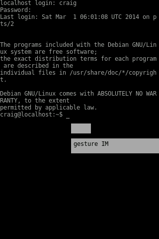

Shelli (shell interface)
==========================

Shelli is a set of tools, hacks or at times a complete operating system which provides a user with the following:

- a unix-style command shell
- easy access to hardware
- natural language commands to manipulate the hardware
- natural language commands to perform common tasks such as: email, calendar, phone calls, text messages, net searching, etc...

Initial targets for Shelli are:
- Geeksphone Keon via sven ola debian + fbcon (fbterm?)
- Motorola C139 via osmocom-bb + nuttx-bb, barebox, ???
- generic pc/laptop

Progress Reports
----------------
Keon +sven ola debian +fbterm -b2g

